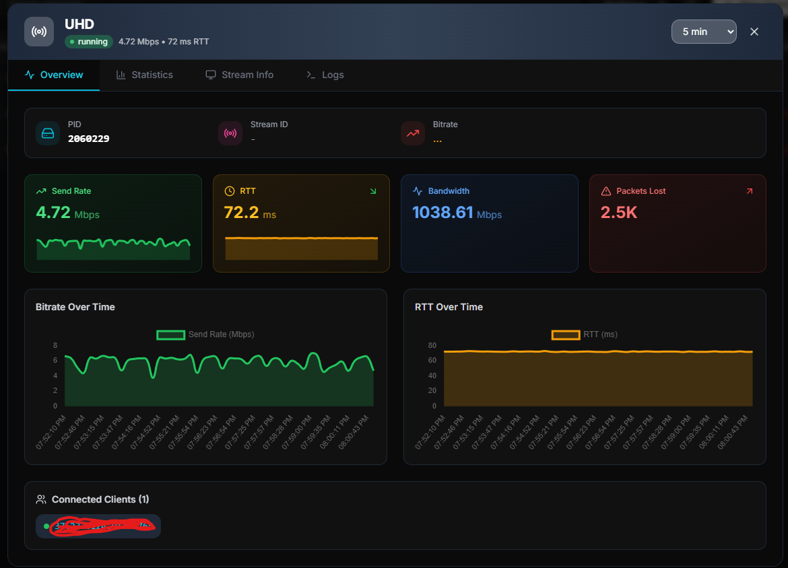
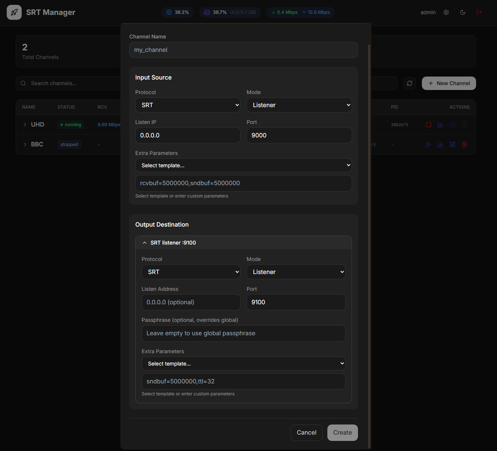
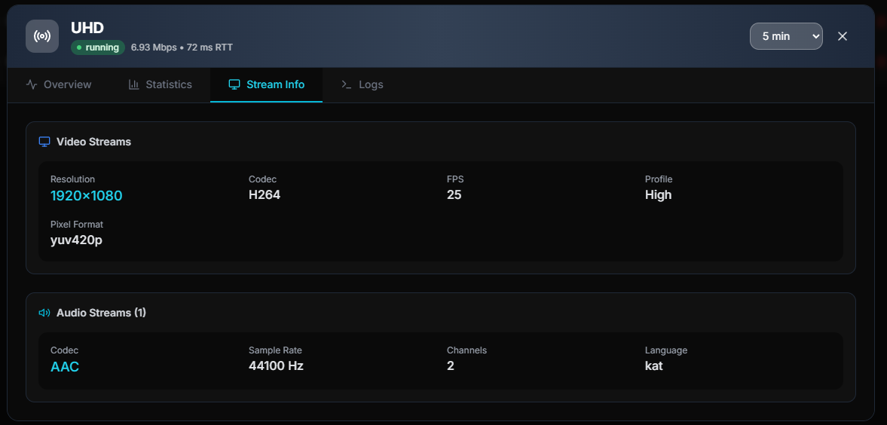
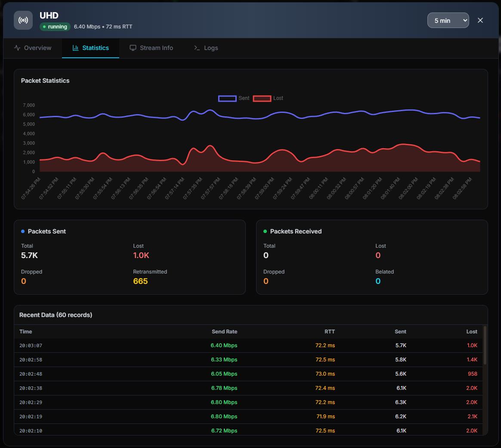
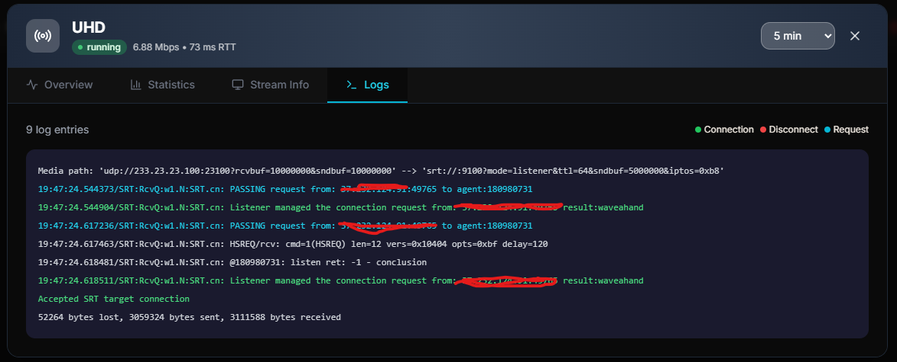
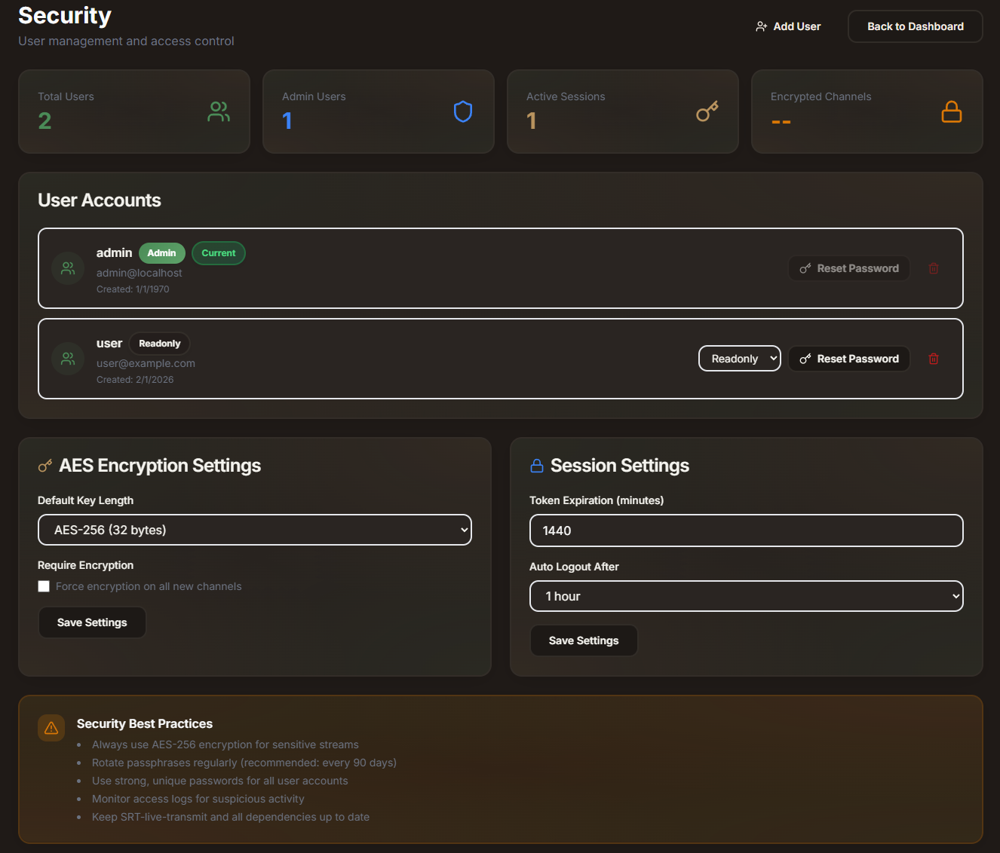

# SRT Manager

[](LICENSE)
[](https://python.org)
[](https://nextjs.org)
[](https://docker.com)

**Professional SRT/UDP streaming management platform.** Control, monitor, and analyze your live streams through a modern web interface.

*Forge your streams with precision.*

---

## Table of Contents

- [Features](#features)
- [Screenshots](#screenshots)
- [Quick Start](#quick-start)
- [Installation](#installation)
- [Configuration](#configuration)
- [Running](#running)
- [Docker](#docker)
- [API Reference](#api-reference)
- [Channel Configuration](#channel-configuration)
- [Architecture](#architecture)
- [Contributing](#contributing)
- [License](#license)

---

## Features

| Feature | Description |
|---------|-------------|
| **Channel Management** | Create, edit, delete, and control SRT/UDP streaming channels |
| **Real-time Monitoring** | Live statistics with bitrate graphs, RTT, and packet loss metrics |
| **Stream Analysis** | Auto-detect video/audio codecs, resolution, FPS, and bitrate via ffprobe |
| **Multi-protocol Support** | SRT (listener/caller/rendezvous) and UDP (unicast/multicast) |
| **Server Stats** | CPU, RAM, and network traffic monitoring in the header |
| **Encryption** | AES-128/192/256 passphrase encryption for SRT streams |
| **Extra Parameters** | Custom SRT/UDP parameters with preset templates |
| **Connection Tracking** | View connected clients in real-time |
| **Logs Viewer** | Filter logs by level, time range, and search keywords |

---

## Screenshots

### Dashboard


### Channel Details


### Create Channel


### Stream Info


### Statistics


### Logs


### User Management


---

## Quick Start

The fastest way to get SRT Manager running is with Docker:

```bash
git clone https://github.com/yourusername/streamforge.git
cd streamforge
docker-compose up -d
```

Open [http://localhost:3000](http://localhost:3000) in your browser.

---

## Installation

### Requirements

- Python 3.10+
- Node.js 18+
- `srt-live-transmit` (from [SRT](https://github.com/Haivision/srt) toolkit)
- `ffprobe` (from [FFmpeg](https://ffmpeg.org/) - for stream analysis)

### Manual Setup

#### 1. Clone the repository

```bash
git clone https://github.com/yourusername/streamforge.git
cd streamforge
```

#### 2. Backend setup

```bash
cd backend
python -m venv venv
source venv/bin/activate  # Linux/macOS
# venv\Scripts\activate   # Windows
pip install -r requirements.txt
```

#### 3. Frontend setup

```bash
cd frontend
npm install
```

---

## Configuration

Create a `.env` file in the root directory:

```env
# Backend
JWT_SECRET_KEY=your-secret-key-change-in-production
LOG_LEVEL=INFO

# Frontend
NEXT_PUBLIC_API_URL=http://localhost:8000
NEXT_PUBLIC_WS_URL=ws://localhost:8000
```

> **Security Note:** Always change `JWT_SECRET_KEY` in production environments.

---

## Running

### Development

Start both services in separate terminals:

```bash
# Terminal 1 - Backend
cd backend
source venv/bin/activate
uvicorn app.main:app --reload --host 0.0.0.0 --port 8000

# Terminal 2 - Frontend
cd frontend
npm run dev
```

Or use the convenience script:

```bash
./start_all.sh
```

### Production

Build and run with Docker (recommended):

```bash
docker-compose up -d
```

Or build the frontend manually:

```bash
cd frontend
npm run build
npm start
```

---

## Docker

```bash
# Build and start containers
docker-compose up -d

# View logs
docker-compose logs -f

# View logs for specific service
docker-compose logs -f backend

# Stop all containers
docker-compose down

# Rebuild after changes
docker-compose up -d --build
```

### Ports

| Service | Port | Description |
|---------|------|-------------|
| Frontend | 3000 | Web UI |
| Backend | 8000 | REST API & WebSocket |

---

## API Reference

### REST Endpoints

| Method | Endpoint | Description |
|--------|----------|-------------|
| `GET` | `/api/channels` | List all channels |
| `POST` | `/api/channels` | Create a new channel |
| `PATCH` | `/api/channels/{name}` | Update channel |
| `DELETE` | `/api/channels/{name}` | Delete channel |
| `POST` | `/api/channels/{name}/start` | Start channel |
| `POST` | `/api/channels/{name}/stop` | Stop channel |
| `GET` | `/api/channels/{name}/stats` | Get channel statistics |
| `GET` | `/api/channels/{name}/logs` | Get channel logs |
| `GET` | `/api/channels/{name}/full-info` | Get full channel info |
| `GET` | `/api/system/stats` | Get server CPU/RAM/network stats |
| `GET` | `/health` | Health check endpoint |

### WebSocket

Connect to `ws://localhost:8000/ws` for real-time updates:
- Channel status changes
- Live statistics
- System metrics

---

## Channel Configuration

### Input (Source)

| Parameter | Description | Example |
|-----------|-------------|---------|
| Protocol | SRT or UDP | `SRT` |
| IP | Listen/source address | `0.0.0.0` |
| Port | Listen/source port | `9000` |
| Mode | SRT mode | `listener`, `caller`, `rendezvous` |
| Extra Params | Additional parameters | `rcvbuf=5000000` |

### Output (Destination)

| Parameter | Description | Example |
|-----------|-------------|---------|
| Protocol | SRT or UDP | `UDP` |
| Host | Destination host | `239.1.1.1` (multicast) |
| Port | Output port | `5000` |
| Mode | SRT mode (if SRT) | `caller` |
| Extra Params | Additional parameters | `ttl=32` |

### Parameter Templates

**Input Presets:**

| Preset | Parameters | Use Case |
|--------|------------|----------|
| Default SRT | `rcvbuf=5000000` | General purpose |
| Low Latency | `latency=50,rcvbuf=1000000` | Live production |
| High Bandwidth | `rcvbuf=10000000,sndbuf=10000000` | 4K/UHD streams |

**Output Presets:**

| Preset | Parameters | Use Case |
|--------|------------|----------|
| Default SRT | `sndbuf=5000000` | General purpose |
| Low Latency | `latency=50,sndbuf=1000000` | Live production |
| High Bandwidth | `sndbuf=10000000,maxbw=0` | 4K/UHD streams |
| UDP Multicast | `ttl=32,mcloop=0` | Multicast distribution |

---

## Architecture

```
┌─────────────────────────────────────────────────────────────┐
│                        SRT Manager                          │
├─────────────────────────────────────────────────────────────┤
│                                                             │
│  ┌─────────────┐         ┌─────────────────────────────┐    │
│  │   Frontend  │◄───────►│          Backend            │    │
│  │  (Next.js)  │   REST  │         (FastAPI)           │    │
│  │   :3000     │   & WS  │          :8000              │    │
│  └─────────────┘         └──────────────┬──────────────┘    │
│                                         │                   │
│                          ┌──────────────┼──────────────┐    │
│                          │              │              │    │
│                          ▼              ▼              ▼    │
│                    ┌──────────┐  ┌──────────┐  ┌──────────┐ │
│                    │  JSON    │  │ srt-live │  │ ffprobe  │ │
│                    │  config  │  │ transmit │  │          │ │
│                    └──────────┘  └──────────┘  └──────────┘ │
│                                                             │
└─────────────────────────────────────────────────────────────┘
```

### Data Storage

All data is stored in a single `config.json` file:

```json
{
  "channels": [
    {
      "channel_name": "My Channel",
      "input_protocol": "srt",
      "input_port": 9000,
      ...
    }
  ],
  "users": [
    {
      "id": 1,
      "username": "admin",
      "hashed_password": "mypassword",
      "email": "admin@localhost",
      "is_active": true
    }
  ]
}
```

> **Tip:** You can set plain text passwords in `config.json` - they will be automatically hashed on server startup. Just edit `hashed_password` with your desired password and restart the backend.

### Tech Stack

**Backend:**
- [FastAPI](https://fastapi.tiangolo.com/) - Modern Python web framework
- [WebSockets](https://websockets.readthedocs.io/) - Real-time communication
- [Pandas](https://pandas.pydata.org/) - Statistics processing
- [psutil](https://psutil.readthedocs.io/) - System monitoring

**Frontend:**
- [Next.js 14](https://nextjs.org/) - React framework
- [Tailwind CSS](https://tailwindcss.com/) - Styling
- [Chart.js](https://www.chartjs.org/) - Data visualization
- [Zustand](https://zustand-demo.pmnd.rs/) - State management

---

## Contributing

Contributions are welcome! Please feel free to submit a Pull Request.

1. Fork the repository
2. Create your feature branch (`git checkout -b feature/amazing-feature`)
3. Commit your changes (`git commit -m 'Add amazing feature'`)
4. Push to the branch (`git push origin feature/amazing-feature`)
5. Open a Pull Request

---

## License

This project is licensed under the MIT License - see the [LICENSE](LICENSE) file for details.
