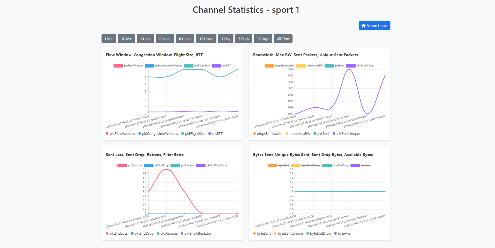

Sure, here's a README.md file for this project:

# SRT Channel Manager

The SRT Channel Manager is a web application built with Flask that allows you to manage SRT (Secure Reliable Transport) channels. It provides a user-friendly interface to create, edit, start, stop, and view the statistics of your SRT channels.

## Features

- Create and manage SRT channels with various configuration options
- Start and stop SRT channels
- View real-time statistics for each channel
- Responsive and modern user interface
- Dark mode support

## Screenshots

### Home Page


### New Channel Page


### Edit Channel Page


### Channel Statistics Page


## Getting Started

### Prerequisites

- Python 3.6 or higher
- Flask
- Pandas
- Werkzeug

### Installation

1. Clone the repository:

   ```
   git clone https://github.com/SmurfManX/srt-live-transmit-web.git
   ```

2. Change into the project directory:

   ```
   cd srt-live-transmit-web
   ```

3. Create a virtual environment and activate it:

   ```
   python -m venv env
   source env/bin/activate  # On Windows: env\Scripts\activate
   ```

4. Install the required dependencies:

   ```
   pip install -r requirements.txt
   ```

5. Run the application:

   ```
   python app.py
   ```

6. Open your web browser and visit `http://localhost:3200` to access the SRT Channel Manager.

## Contributing

Contributions are welcome! If you find any issues or have suggestions for improvements, please open an issue or submit a pull request.

## License

This project is licensed under the [MIT License](LICENSE).

<a href="https://www.buymeacoffee.com/smurfmanx" target="_blank"></a>
